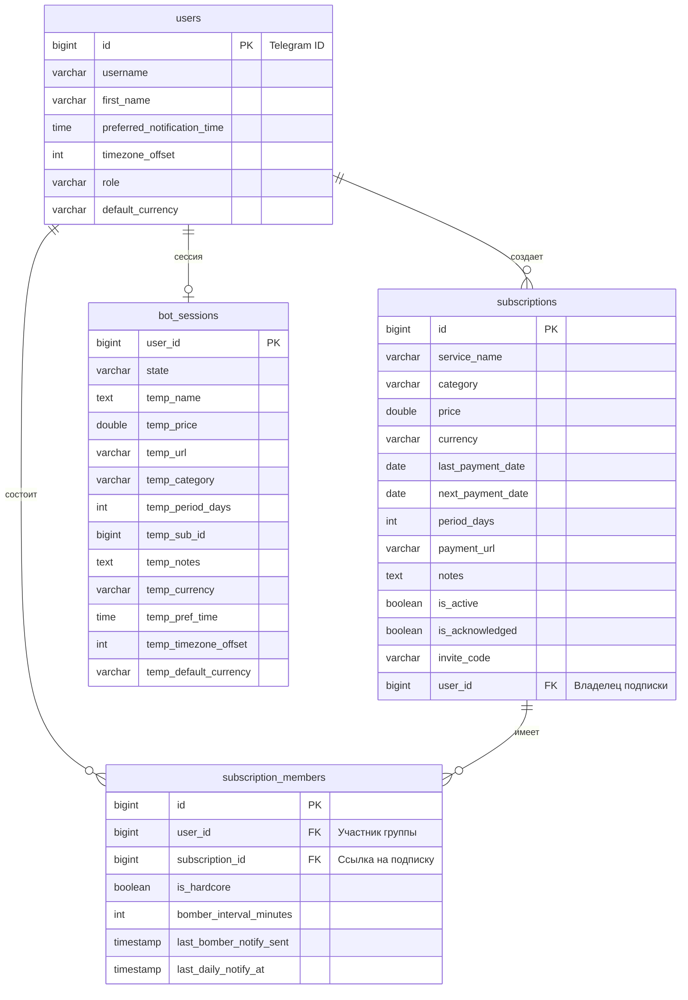

# SubChecker

Telegram-бот на Java и Spring Boot, который помогает следить за подписками и вовремя их оплачивать. Подходит как для личного использования, так и для совместных подписок с друзьями (семейных аккаунтов).

## Опробовать бота в Telegram

Бот запущен на сервере и доступен по ссылке: [@ADHD_SUB_bot](https://t.me/ADHD_SUB_bot)

---

## Что умеет бот

* **Следить за подписками**: можно добавить название, цену, валюту (RUB, USD, EUR, KZT), период оплаты, ссылку на личный кабинет и заметки.
* **Присылать напоминания**: бот напоминает о платеже за день и в день списания. Время и часовой пояс настраиваются в профиле.
* **Бомбить уведомлениями (Режим Bomber)**: если день оплаты наступил, а вы забыли нажать кнопку «Оплатил», бот будет присылать напоминания с заданным интервалом (от 15 минут до 2 часов), пока вы его не выключите.
* **Групповые подписки**: можно сгенерировать инвайт-код и поделиться им с друзьями. Они вступят в вашу подписку и тоже будут получать напоминания. Владелец подписки может управлять списком участников (выгонять лишних).

## Стек технологий

* Java 17
* Spring Boot 3
* PostgreSQL (база данных)
* Flyway (миграции базы)
* Библиотека TelegramBots (для работы с Telegram API)
* Gradle (сборщик проекта)

## Таблицы в базе данных

* **User** — пользователи бота, их часовые пояса и время для уведомлений.
* **Subscription** — сами подписки (название, цена, даты платежей, инвайт-код).
* **SubscriptionMember** — участники групповых подписок и их личные настройки бомбера.
* **BotSession** — временный стейт, чтобы бот понимал, какой вопрос сейчас задать пользователю при создании подписки.


## Локальное развертывание

1. Создайте пустую базу данных в PostgreSQL:
   ```sql
   CREATE DATABASE sub_manager;
   ```
2. Настройте параметры подключения и токен бота в файле `src/main/resources/application.yml`:
   ```yaml
   spring:
     datasource:
       url: jdbc:postgresql://localhost:5432/sub_manager
       username: your_username
       password: your_password
     jpa:
       hibernate:
         ddl-auto: validate
     flyway:
       enabled: true
       locations: classpath:db/migration

   telegram:
     bot:
       name: your_bot_username
       token: your_bot_token
   ```
3. Запустите проект из корневой директории:
   ```bash
   ./gradlew bootRun
   ```
   *(Flyway автоматически применит миграции и создаст структуру таблиц при первом старте).*

## Как устроен проект внутри

* **Отслеживание статусов**: Чтобы бот понимал, на какой вопрос сейчас отвечает пользователь (например, вводит цену или название), используется механизм сессий. Вся история временно сохраняется в таблице `bot_sessions`.
* **Автоматические напоминания**: Внутри настроен планировщик (Spring Scheduler). Он регулярно проверяет базу данных, находит подписки, по которым пора платить, и отправляет сообщения пользователям.
* **Надежное хранение данных**: Структура базы данных защищает от ошибок. Например, если удалить подписку, автоматически удалятся и её участники, а инвайт-коды гарантированно будут уникальными.